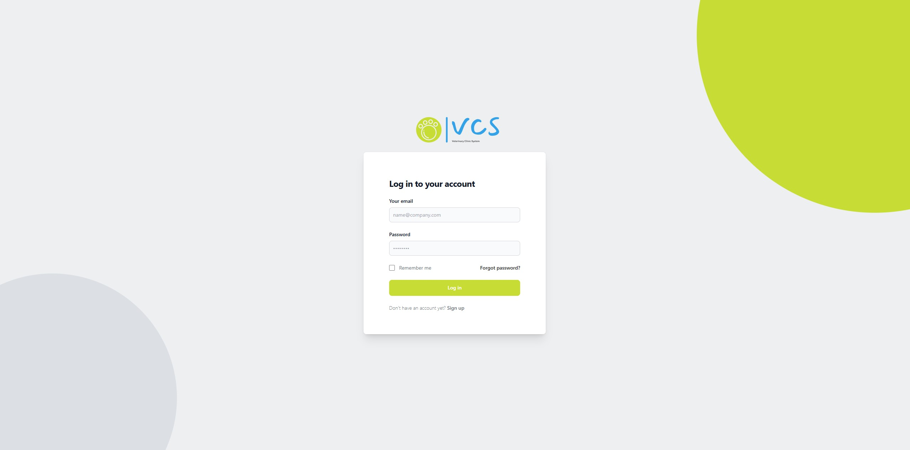
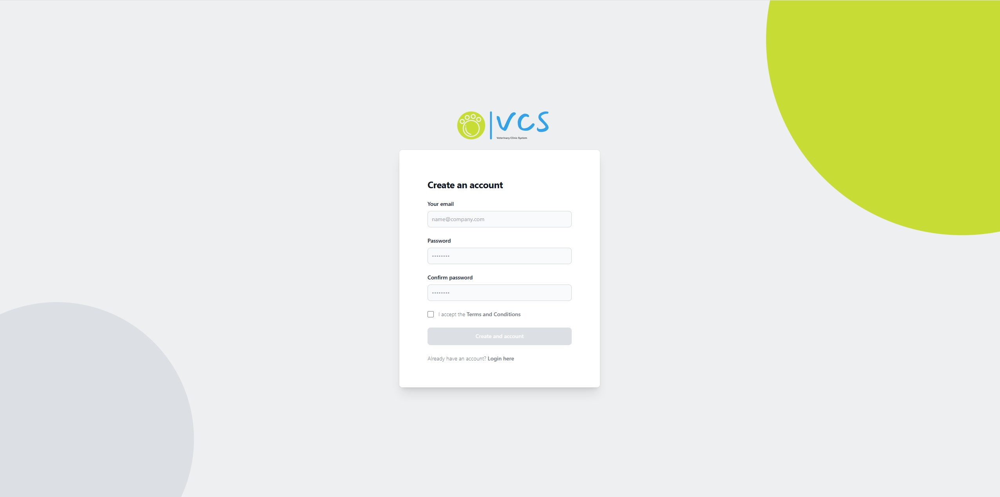
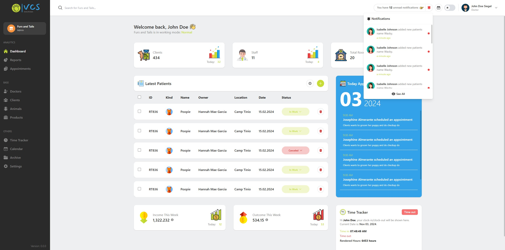

# Vet Clinic Admin Panel (POC)

Welcome to the **Vet Clinic Admin Panel**! This project is an admin dashboard for veterinary clinics, designed as a **proof of concept (POC)** and learning project. It’s built using **Vite** for development, **ReactJS** for UI, **Tailwind CSS** for styling, and **Zustand** for state management. The dashboard allows for managing clinic data, including doctors, animals, clients, products, appointments, calendars, and reports etc...

> **Note**: This project showcases my expertise in frontend development as part of my journey to becoming a full-stack web developer. The backend for this project can be found in the [vet-clinic-backend](https://github.com/Arvey18/vet-clinic-backend) repository and is being developed using **Node.js**, **Express**, and **PostgreSQL**. This POC is ongoing and will be further developed as time allows.

## 📚 Project Overview

This admin panel is designed to streamline the day-to-day operations of a veterinary clinic, making it easy for clinic staff to manage important information and resources efficiently.

### Key Features

- **Doctors Management**: Keep track of doctor profiles, schedules, specialties, and availability.
- **Animals Database**: Record animal details, medical history, and owner's contact information.
- **Client Information**: Manage client profiles and relationships to animals.
- **Product Inventory**: Maintain product records, stock levels, and prices for clinic supplies.
- **Appointments & Scheduling**: Schedule and manage appointments, with calendar integration.
- **Reports**: Access visual reports for clinic performance, appointments, revenue, and more.
- **Time Tracker**: Employees can time-in and time-out providing them also how many hours already rendered working in the current day.

## 🛠️ Tech Stack

### Frontend

- **Vite**: Fast bundling and development for modern frontends.
- **ReactJS**: Component-based UI design for a dynamic, interactive interface.
- **Tailwind CSS**: Utility-first CSS framework for rapid UI styling and customization.
- **Zustand**: Lightweight state management, making it easy to manage and share state across components.

### Backend (POC - Separate Repository)

- **Node.js** & **Express**: Backend server and API development.
- **PostgreSQL**: Relational database for securely storing clinic data.
- **Repository**: [vet-clinic-backend](https://github.com/Arvey18/vet-clinic-backend)

## 🚀 Getting Started

### Prerequisites

- [Node.js](https://nodejs.org/) v14+ and npm (or [Yarn](https://yarnpkg.com/))

### Installation

1. Clone the repository:
   ```bash
   git clone git@github.com:Arvey18/vet-clinic-frontend.git
   cd vet-clinic-frontend
   ```
2. Install dependencies::
   ```bash
   npm install or yarn install
   ```
3. Start the development server:
   ```bash
   npm run dev or yarn dev
   ```
4. Open your browser and go to [http://localhost:3000](http://localhost:3000)

## 📐 Project Structure

```bash
vet-clinic-frontend/
├── public/                  # Public assets
├── src/
│   ├── assets/              # Images, logos, and other static assets
│   ├── components/          # Reusable React components
│   ├── pages/               # Application pages (Dashboard, Doctors, Animals, etc.)
│   ├── constants/           # Fixed values stored in variables for easy reference
│   ├── store/               # Zustand store configuration
│   ├── layout/              # Layout components that wrap pages based on content
│   ├── helpers/             # Helper functions for processing API responses
│   ├── routing/             # Route configuration for protected and unprotected route
│   ├── utils/               # Reusable utility functions
│   ├── App.jsx              # Main application component
│   └── main.jsx             # Entry point
└── README.md
```

## 🗂️ Pages Overview

- **Dashboard**: Overview of clinic metrics, latest updates, and quick actions.
- **Doctors**: List of all doctors, with profile details and schedules.
- **Animals**: Animal records and their medical histories.
- **Clients**: Manage client profiles and related animals.
- **Products**: Inventory management for products and supplies.
- **Appointments**: View and schedule appointments.
- **Reports**: Visual reports on clinic performance and operational metrics.

## 🧑‍💻 Contributing

Contributions are welcome! If you'd like to contribute, please open a pull request or issue with your suggestions or improvements.

## 🌐 Learn More

- [Vite Documentation](https://vitejs.dev/)
- [React Documentation](https://reactjs.org/)
- [Tailwind CSS Documentation](https://tailwindcss.com/)
- [Zustand Documentation](https://zustand-demo.pmnd.rs/)

## 📷 Screenshots (Updated as of Nov 03, 2024)

### Login Page



### Register Page



### Dashboard Page


